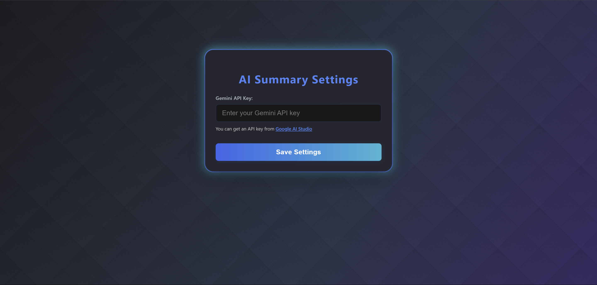
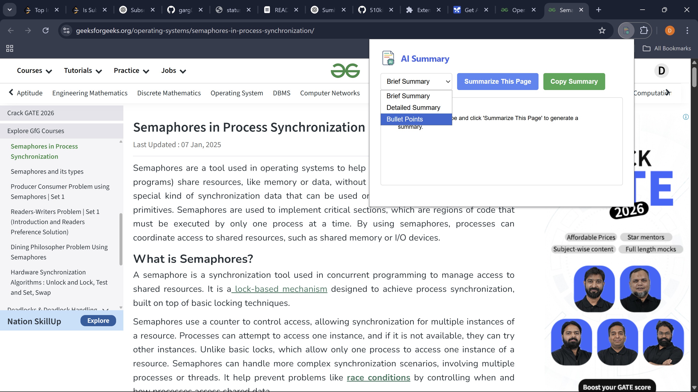
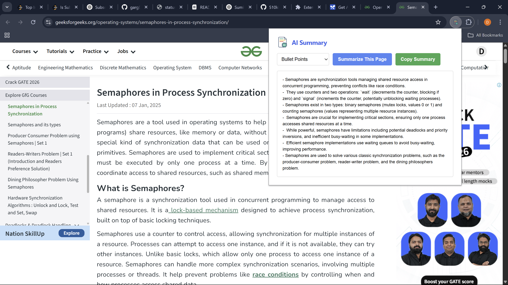

  

<h1 align="center">⚡ SumItUp</h1>

<strong>AI-Powered Chrome Extension to Instantly Summarize Articles, Blogs, and Study Material</strong>

  
  
  

---

## 🔥 Why Use SumItUp?

> **Struggling with long tutorials or endless articles?**
>
> 🧠 Let **AI summarize** them for you in seconds!

SumItUp is a sleek Chrome Extension that uses the **Gemini API** to condense long-form content into bite-sized summaries—without leaving your browser.

---

## 🛠️ Tech Stack

- **Frontend**: HTML, CSS, JavaScript  
- **Extension Platform**: Manifest V3  
- **AI Integration**: Gemini API  

---

## ✨ Features

- ✅ **One-Click Summaries**  
- ✅ 3 Modes:  
  - 📄 Brief  
  - 📚 Detailed  
  - 📌 Bullet Points  
- ✅ **Copy to Clipboard**  
- ✅ First-Time API Key Prompt  
- ✅ Light, Fast & Responsive

---

## ⚙️ Setup Instructions

> 🔑 Make sure you have a [Gemini API Key](https://aistudio.google.com/app/apikey)

### Step 1: Load the Extension

1. Download the ZIP of this repo and **extract** it  
2. Open Chrome and go to: `chrome://extensions/`  
3. Enable **Developer Mode** (top right)  
4. Click **Load Unpacked**  
5. Select the extracted folder → You're done ✅

### Step 2: Set Up the API Key

- On first use, you’ll be prompted to enter your **Gemini API Key**  
- The key is stored securely in local storage  
- You can update or reset it anytime

---

## 💡 How to Use

1. Open any blog, article, or tutorial  
2. Click the 🧠 **SumItUp icon** in the Chrome toolbar  
3. Choose one of the three summary modes  
4. Your summary appears instantly! 🎉  
5. Click **Copy** to save the result  

---

## 📸 Screenshots

  
   <em>🔐 API Key setup prompt for Gemini</em>

 

  
   <em>🧠 Select from Brief, Detailed, or Bullet Summary</em>

 

  
   <em>📝 AI-generated summary output</em>

---

## 👨‍💻 Author

**Dhruv Garg**  
📧 dhruvgarg729729@gmail.com  
🌐 [Portfolio](https://dhruv-one.vercel.app)  
🔗 [LinkedIn](https://linkedin.com/in/dhruv-garg-ab15302b4)  
💻 [GitHub](https://github.com/gargDhruv12)

---

## 📃 License

This project is licensed under the **MIT License**.  
Feel free to use, modify, and share with proper credit.

---

<strong>🚀 Ready to supercharge your reading with AI? Try SumItUp now!</strong>

